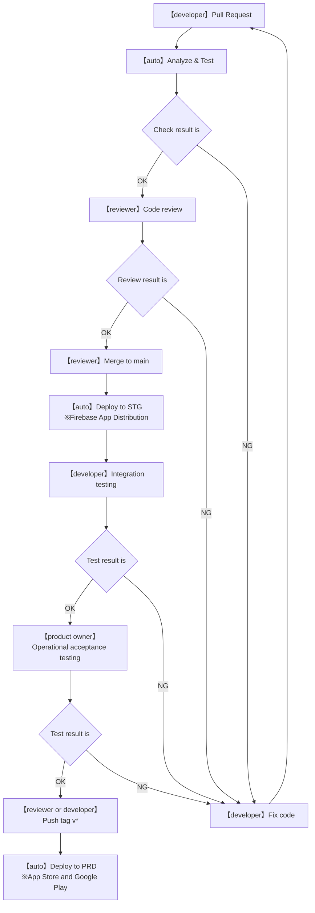

# 獣医勉強アプリ

## 環境構築
### flutter (fvm利用)は以下を実施
https://zenn.dev/moribook/articles/88a96133449b67

## ブランチの運用ルール
* main: 安定ブランチ。常にリリース可能なソースコードを管理。
* feature/xxxx: 機能開発用ブランチ。mainから切り、開発する機能に応じて作成。xxxxには開発する機能の内容を記載。

## 環境
* DEV: ローカル環境以外の開発環境は用意しない。各自**featureブランチ**や**mainブランチ**をローカルで動かし、動作確認する。
* STG: Firebase App Distributionを用意し、関係者にテスト配信する。**mainブランチ**からCI/CDで自動デプロイされる。
* PRD: v*.*.*(例:v1.0.0)のようなタグをつけて、「Publish release」したソースをApp StoreやGoogle Playに自動配信する。

### 参考
* https://qiita.com/okdyy75/items/83e3f2ae0bbc0284a92c

## CICDパイプライン（整備中）

### CICDを利用するための設定（各ユーザーで設定は不要）
1. Personal Access Tokenを作成（tokenはコピーしておく）

https://dev.classmethod.jp/articles/github-personal-access-tokens/

2. 作成したTokenをリポジトリのsecretに、GH_PATという名前で登録

https://qiita.com/silvia_hacks/items/fbda864c3bd8017bee1b#%E7%99%BB%E9%8C%B2

### 参考
* https://zenn.dev/nozomi_cobo/articles/flutter-firebase-modern-architecture#ci-%2F-cd
* https://zenn.dev/yorifuji/articles/flutter-github-actions-template